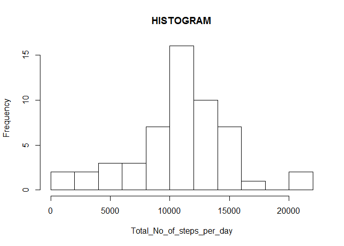
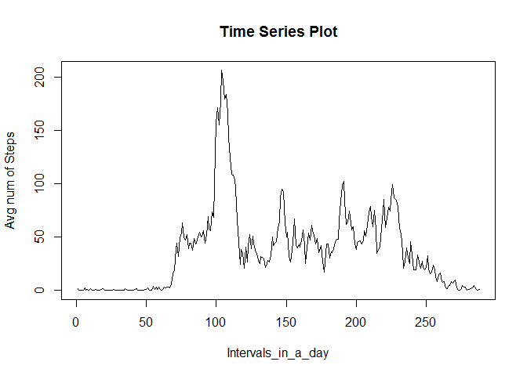
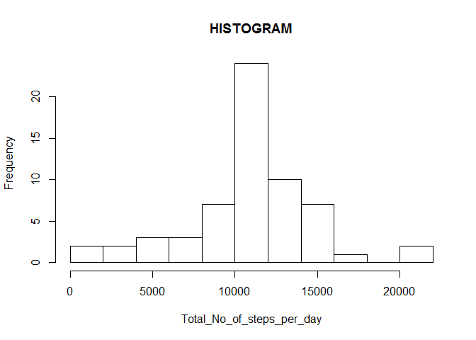
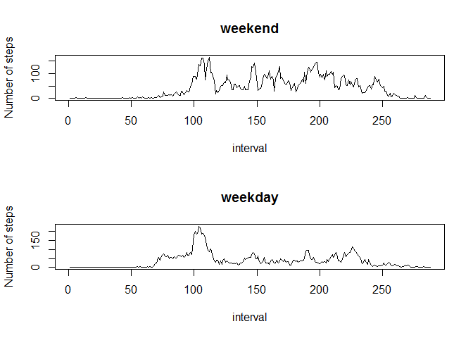

# Reproducible Research: Peer Assessment 1


## Loading and preprocessing the data

```r
library(knitr)
library(dplyr)
```

```
## 
## Attaching package: 'dplyr'
## 
## The following object is masked from 'package:stats':
## 
##     filter
## 
## The following objects are masked from 'package:base':
## 
##     intersect, setdiff, setequal, union
```

```r
unzip(zipfile = "activity.zip")
actdf <- read.csv("activity.csv")
no_of_days = 61
no_of_intv_per_day = 288
```


## What is mean total number of steps taken per day?

- The histogram of total number of steps taken per day is shown below:  


```r
## Make a histogram of the total number of steps taken each day
perday <- split(actdf, actdf$date)
sumarrays2 <- sapply(perday, function(elt) ifelse(all(is.na(elt$steps)), NA, sum(elt$steps, na.rm=TRUE)))
sumarrays23 <- sumarrays2[!is.na(sumarrays2)]
hist(sumarrays23, breaks=10, main = "HISTOGRAM", xlab = "Total_No_of_steps_per_day")
```

 

```r
## Mean and Median
me1 <- mean(sumarrays23)
med1 <- median(sumarrays23)
```

- Mean of total number of steps taken per day =  1.0766189\times 10^{4}
- Median of total number of steps taken per day = 10765


## What is the average daily activity pattern?

- The time series plot of 5-min interval vs the avg number of steps taken is shown below.
- The X-axis has 288 points correspoding to the number of 5-min intervals in a day.


```r
##time series plot (i.e. type = "l") of the 5-minute interval (x-axis)
##and the average number of steps taken, averaged across all days (y-axis)
perintv <- split(actdf, actdf$interval)
nbOfintv <- length(perintv)
meanintvarray <- sapply(perintv, function(elt) mean(elt$steps, na.rm=TRUE))
plot(x = 1:length(meanintvarray), y = meanintvarray, type = "l", main = "Time Series Plot", xlab = "Intervals_in_a_day", ylab = "Avg num of Steps")
```

 

```r
#axis(side=1, at = 0:2355)
##5-minute interval, on average across all the days in the dataset,
##contains the maximum number of steps
max1 <- max(meanintvarray)
maxintv1 <- which.max(meanintvarray)
```
- The 5-min interval (on avg across days), which contains the max number of steps is =  835


## Inputting missing values


```r
## report the total number of missing values in the dataset
actdf$missing <- is.na(actdf$steps)
missing4 <- actdf$steps[is.na(actdf$steps)]
lenmissing <- length(missing4)
```

- The total number of missing values in the dataset = 2304

- The histogram of total number of steps taken per day in dataset with filled-in missing values:  


```r
## filling in all of the missing values in the new dataset, using mean of intervals
actdf2 <- actdf
rown <- as.numeric(row.names(actdf2))
rowchars <- row.names(actdf2)
#head(actdf2, n=3)
actdf2$indexofintvperday <- rep(1:no_of_intv_per_day, times=no_of_days)  ## create new col
index2missCol <- match("missing", names(actdf2))
index2intvperday  <- match("indexofintvperday", names(actdf2))
index2stepscol <- match("steps", names(actdf2))
for (i in rown) {
  if (actdf2[i,index2missCol] == TRUE){
    ## Copy mean of interval from array already calc
    index <- (actdf2[i,index2intvperday])
    actdf2[i,index2stepscol] <- meanintvarray[[index]]
    actdf2[i,index2missCol] <- FALSE
  }
}
#head(actdf2, n=3)
rown <- as.numeric(row.names(actdf2))
## Make a histogram of the total number of steps taken each day
perday2 <- split(actdf2, actdf2$date)
## Make a histogram of the total number of steps taken each day
sumarrays22 <- sapply(perday2, function(elt) ifelse(all(is.na(elt$steps)), NA, sum(elt$steps, na.rm=TRUE)))
sumarrays223 <- sumarrays22[!is.na(sumarrays22)]
hist(sumarrays223, breaks=10, main = "HISTOGRAM", xlab = "Total_No_of_steps_per_day")
```

 

```r
## Mean and Median
me2  <- mean(sumarrays223)
med2 <- median(sumarrays223)

## Impact is that mean increases but median decreases.
```

- Mean of total number of steps taken per day in new dataset = 1.0766189\times 10^{4}
- Median of total number of steps taken per day in new dataset = 1.0766189\times 10^{4}

- Impact of filling in the missing values is, that both mean and median increase to the same value!!!

## Are there differences in activity patterns between weekdays and weekends?

```r
library(knitr)
library(dplyr)

actdf2$date <- as.Date(actdf2$date)
#head(actdf2, n=3)
actdf2$dayname <- weekdays(actdf2$date)
llist <- vector(mode="character", length = (no_of_days * no_of_intv_per_day))
llist <- rep("weekday")

rown <- as.numeric(row.names(actdf2))
index2wkdaycol <- match("dayname", names(actdf2))
for (i in rown){
  if ((actdf2[i, index2wkdaycol] == "Saturday") | (actdf2[i,index2wkdaycol] == "Sunday")) {
    llist[i] <- "weekend"
  }
  else{
    llist[i] <- "weekday"
  }
}
actdf2$wkday <- llist
actdf2$wkday <- as.factor(actdf2$wkday)

#head(actdf2, n=3)

#### filter the data for weekdays: use dplyr
wdf1 <- filter(actdf2, wkday == "weekday")
wdf2 <- filter(actdf2, wkday == "weekend")
perintv11 <- split(wdf1, wdf1$interval)
nbOfintv11 <- length(perintv11)
meanintvarray11 <- sapply(perintv11, function(elt) mean(elt$steps, na.rm=TRUE))


perintv22 <- split(wdf2, wdf2$interval)
nbOfintv22 <- length(perintv22)
meanintvarray22 <- sapply(perintv22, function(elt) mean(elt$steps, na.rm=TRUE))

par(mfcol=c(2,1))
plot(x = 1:length(meanintvarray22), y = meanintvarray22, type = "l", main = "weekend", ylab="Number of steps", xla = "interval")
plot(x = 1:length(meanintvarray11), y = meanintvarray11, type = "l", main = "weekday", ylab="Number of steps", xla = "interval")
```

 

```r
#axis(side=1, at = 0:2355)
```


